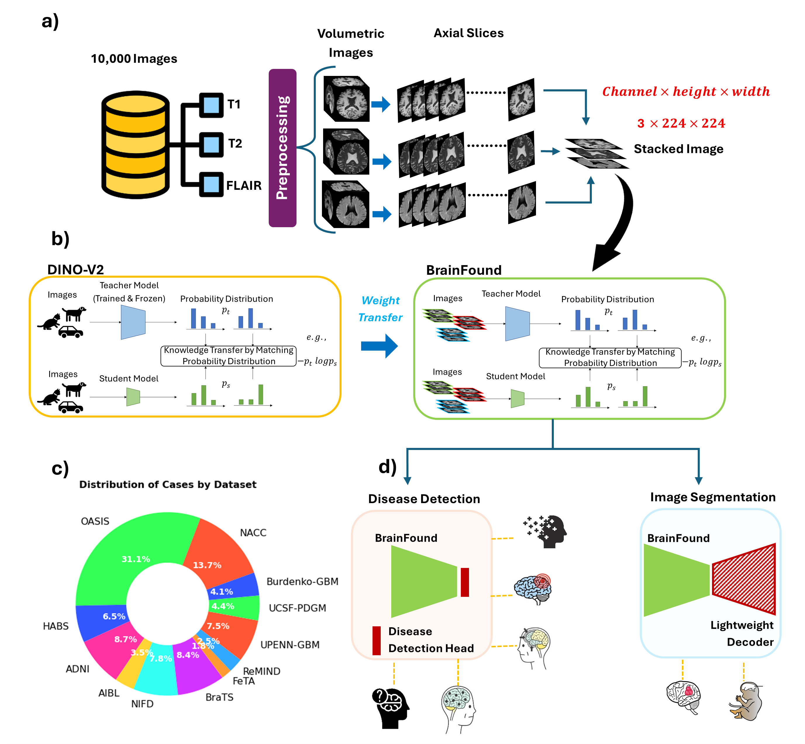

# BrainFound 🧠✨

BrainFound is a 3D self-supervised foundation model for brain MRI, designed to tackle the growing demand for accurate, scalable, and automated neuroimaging analysis. By extending the DINOv2 framework from 2D to volumetric, multimodal brain scans, BrainFound learns rich representations from unlabeled data and powers both disease classification and anatomical segmentation in a unified framework.

# Why BrainFound?

- Radiologist workloads are unsustainable – interpreting one image every 3–4 seconds leads to delays and errors.

- Labeled datasets are expensive – traditional supervised deep learning struggles with scalability.

- 3D context matters – volumetric MRI preserves spatial relationships critical for accurate diagnosis.

- Multimodal imaging improves performance – combining T1, T2, and FLAIR captures complementary structural information.

BrainFound addresses these challenges with self-supervised learning, enabling generalizable, annotation-efficient brain MRI analysis.

# Key Features 🚀

- 3D SSL model – learns from volumetric brain MRI scans.

- Multimodal support – T1, T2, FLAIR (easily extendable to other contrasts).

- Voxel resolution agnostic – works with isotropic and anisotropic scans.

- Unified multitask capability – supports:

    - Multi-disease classification (e.g., dementia subtypes, tumor grading)

   -  Multi-region anatomical and tumor segmentation

- Robust generalization – works across datasets, resolutions, and imaging protocols.

- Few-shot performance – excels with limited labeled data.

# Repository Structure

BrainFound/

├── Dataset/

│   ├── __init__.py

│   └── multimodal_mri_dataset.py

├── Preprocessing/

│   ├── dicom_to_nifti.py

│   └── kfold_split.py

├── docs/

│   └── brainfound_workflow.png

├── examples/

│   ├── demo.py

│   ├── run_dataloader_example.py

│   └── use_preprocess_with_mripreprocessor

├── models/

│   ├── dinov2_base.py

│   └── brainfound.py

├── scripts/

│   ├── generate_folds.py

│   └── preprocess_with_mripreprocessor.py

├── LICENSE

├── README.md

└── requirements.txt

# Requirements & Setup
1️⃣ Clone the repository
git clone https://github.com/Moona-Mazher/BrainFound.git
cd BrainFound

2️⃣ Create a Python environment (recommended)

Using conda:

conda create -n brainfound python=3.11
conda activate brainfound

Or using virtualenv:

python -m venv brainfound_env
brainfound_env\Scripts\activate   # Windows

3️⃣ Install dependencies
pip install -r requirements.txt

Key packages included: torch, torchvision, albumentations, SimpleITK, pandas, numpy, mripreprocessor, scikit-learn, matplotlib.

4️⃣ Verify installation
python -c "import torch, albumentations, SimpleITK, pandas, numpy; print('Packages loaded!')"

# Citation

If you use BrainFound in your work, please cite:

@article{mazher2025towards,

  title={Towards Generalisable Foundation Models for 3D Brain MRI},
  
  author={Mazher, Moona and Parker, Geoff JM and Alexander, Daniel C},
  
  journal={arXiv preprint arXiv:2510.23415},
  
  year={2025}
  
}
